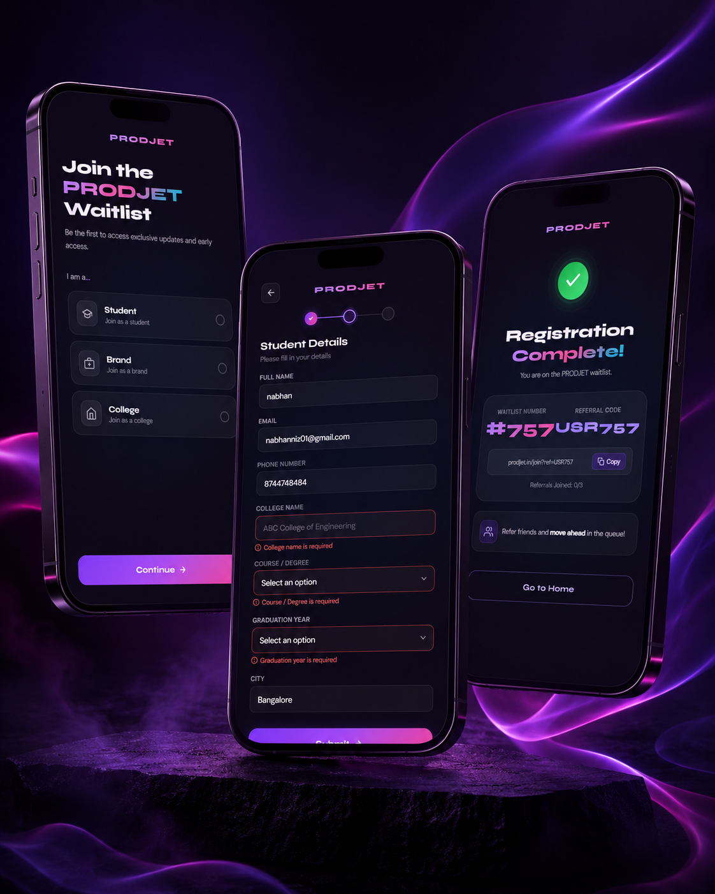

# PRODJET Waitlist Form



This is my submission for the PRODJET frontend intern coding assignment. The task was to build a conditional waitlist form where different fields show up based on what type of user you are — Student, Brand, or College.

## What it does

There are 3 screens:

* User type selection — you pick whether you're a Student, Brand, or College
* The form — common fields (name, email, phone) show for everyone, then extra fields appear depending on what you picked
* Success screen — shows your waitlist number and a referral code after submitting

No backend needed, everything runs in the browser with mock data for the success screen.

## How to run it

```bash
npm install
npm run dev
```

Then open http://localhost:5173

## Tech used

* React + TypeScript
* Vite
* Plain CSS (no UI libraries, wrote everything from scratch)

## What I built for the required features

* User type selection with 3 options (Student, Brand, College)
* Fields change dynamically based on the selected type
* Form validation on all fields — shows error messages if something is missing or wrong
* Success screen with waitlist number #757, referral code USR757, and a copy link button

## Bonus features I added

* Mobile phone frame — the whole app sits inside a phone frame with a notch, so it looks like a real mobile app
* Animated background — there are 5 glowing colour orbs (purple, pink, cyan, teal) that pulse and move in the background, keeping it alive
* Screen transitions — smooth animations when moving between the 3 screens
* Better validation messages — each field shows a specific error with an icon instead of just a generic message
* Reusable components — InputField and SelectField are their own components used across the form
* TypeScript — everything is typed properly
* Mobile responsive — on an actual phone the frame disappears and it goes full screen

## Folder structure

```text
src/
├── components/
│   ├── AnimatedBackground.tsx
│   ├── UserTypeScreen.tsx
│   ├── FormScreen.tsx
│   ├── SuccessScreen.tsx
│   ├── InputField.tsx
│   └── SelectField.tsx
├── hooks/
│   └── useFormValidation.ts
├── types/
│   └── index.ts
├── App.tsx
├── main.tsx
└── styles.css


```
